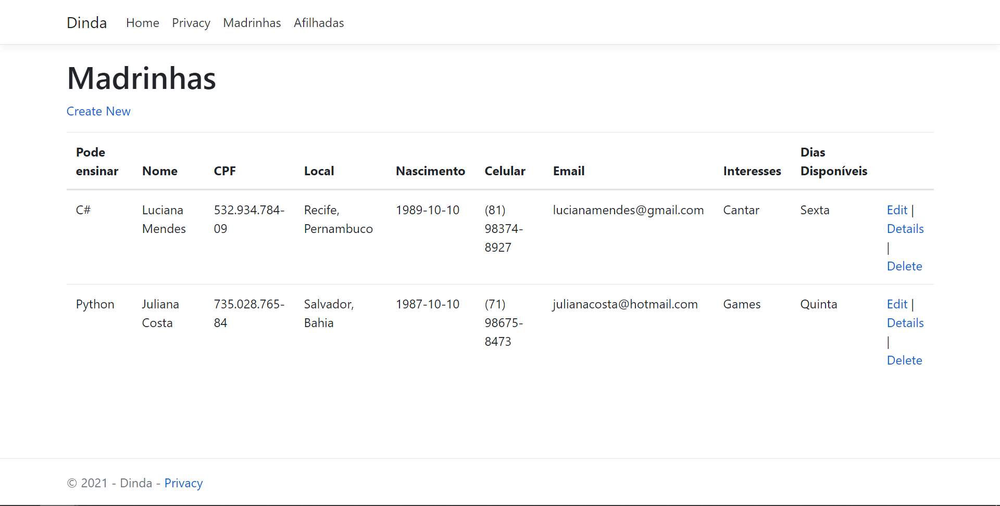
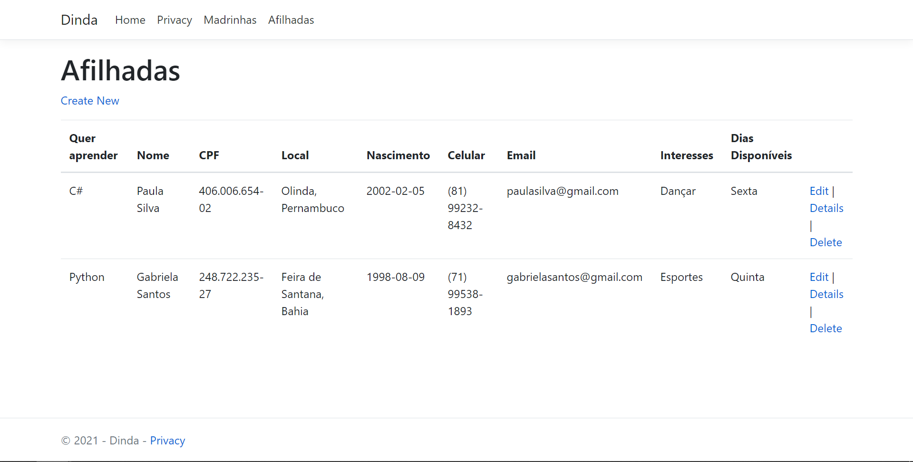

# Desafio-Residencia
Este projeto é um protótipo da plataforma dinda, que está em desenvolvimento pelo M.I.N.A.S do Porto Digital.
Desenvolvemos durante uma residência com o Porto Digital. Concluimos algumas telas do front-end, e fizemos uma web application ASP .NET MVC com o Entity Framework para cadastro das usuárias.

#### Front-End
https://mateusntn.github.io/Desafio-Residencia/

#### Back-End

